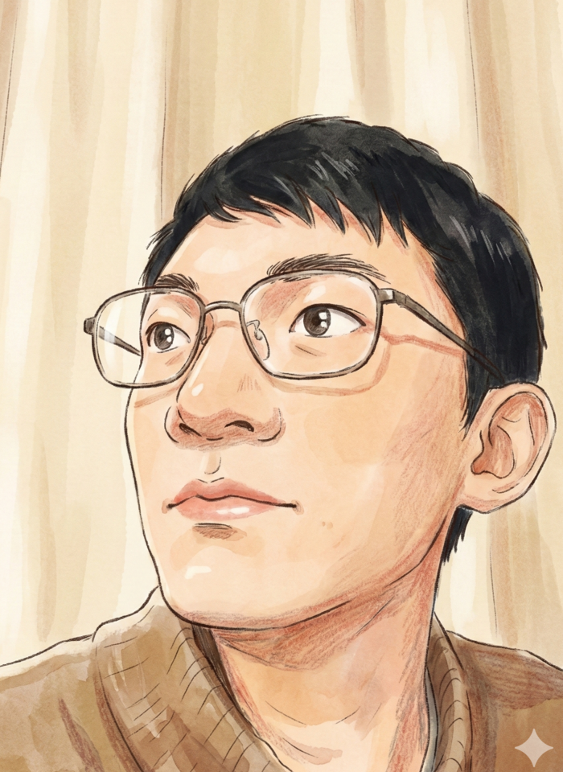

<h1 align="center">
  Hi, I'm Zhi-Zheng Xiang (向 志政)
  
</h1>

  

<table>
  <tr>
    <td width="70%" valign="top">
      <h2>
         
        <b>About Me</b>
      </h2>
      <ul>
        <li>
            🔭 <b>Research Interests</b>: My focus is on <b>Deep Learning</b>, <b>Computer Graphics</b>, and specifically <b>Style Transfer</b>.
        </li>
         
        <li>
            🎓 <b>Education</b>: Currently a PhD Candidate at the <b>University of Tsukuba</b>, affiliated with the <a href="https://www.image.iit.tsukuba.ac.jp/">Computer Vision and Image Media Lab</a>.
        </li>
         
        <li>
            🎥 <b>Content Creator</b>: I create deep learning tutorials on <a href="https://space.bilibili.com/12580263">Bilibili</a>.
        </li>
         
        <li>
            🎮 <b>Fun Fact</b>: A <b>Counter-Strike</b> player and PC hardware enthusiast.
        </li>
         
        <li>
            💬 <b>Languages</b>: Native in Chinese, fluent in English and Japanese.
        </li>
         
        <li>
            📍 <b>Location</b>: Living in <b>Tsukuba, Japan</b> .
        </li>
      </ul>
    </td>
    <td width="30%" valign="center"> 

        
         
        <b>Zhi-Zheng Xiang</b>
      

    </td>
  </tr>
</table>

##  **Skills**